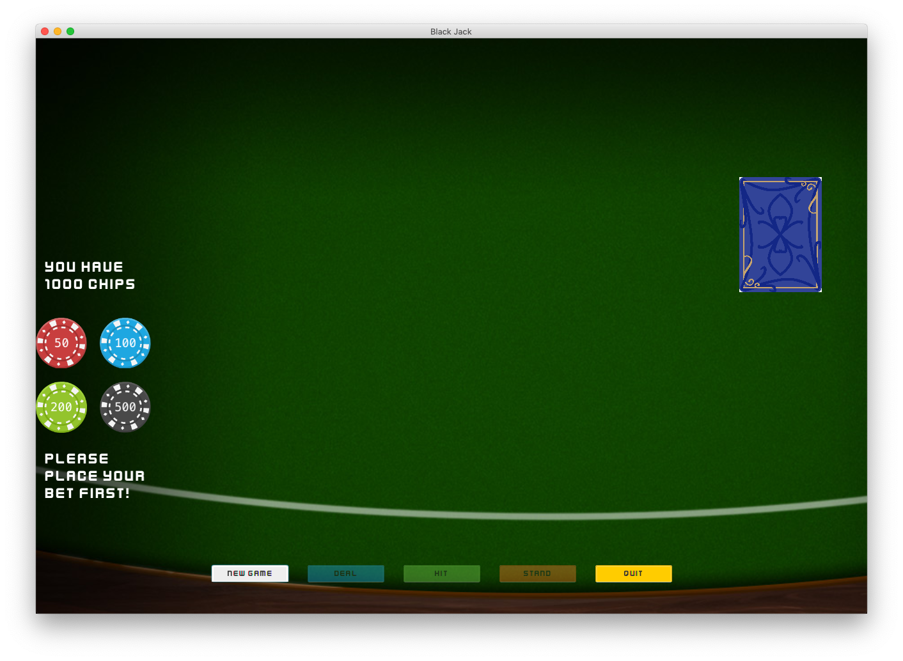
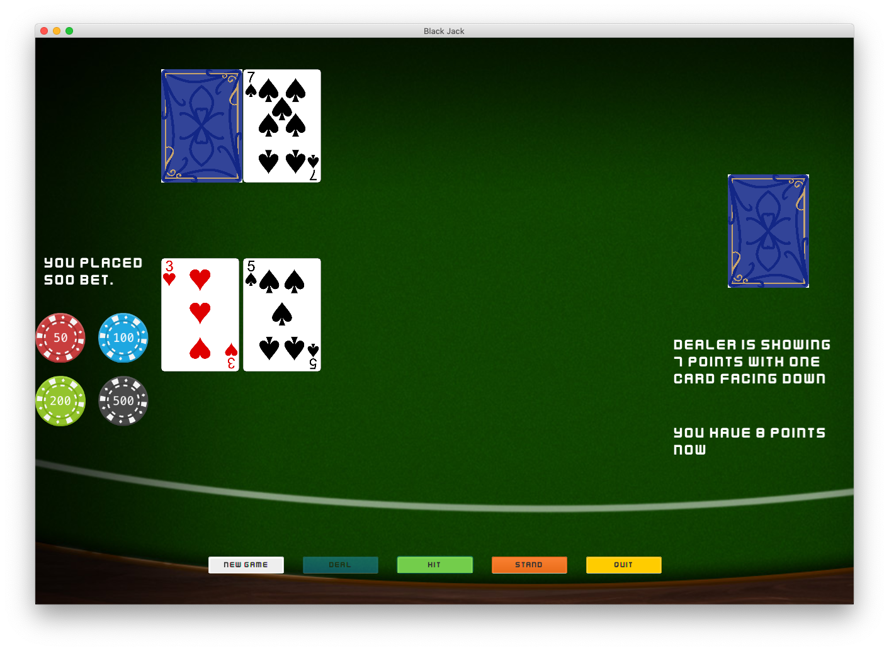
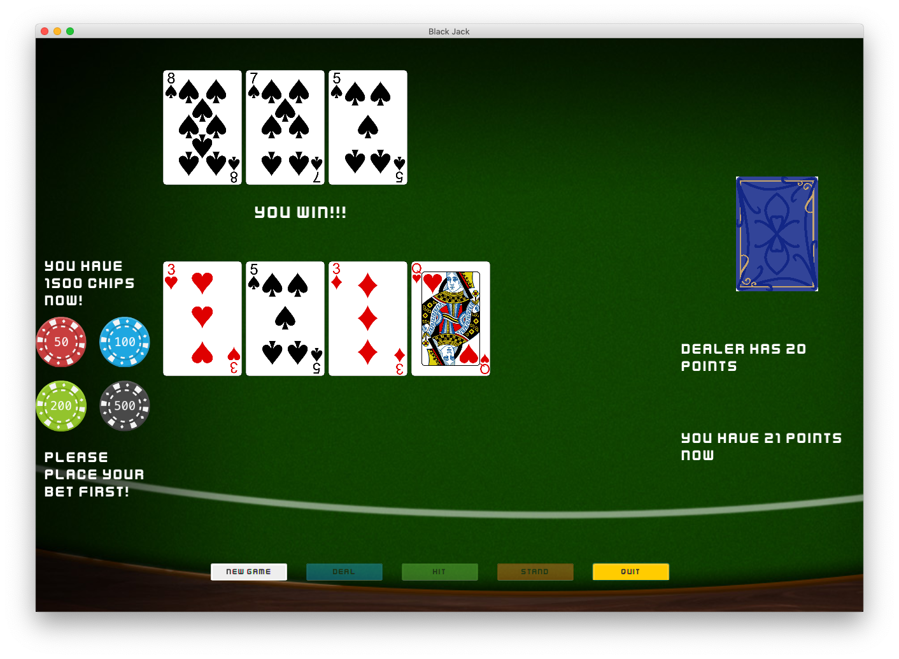

# BlackJack-JavaFX (A simple Black Jack game using JavaFX)

## Rules:

1. Dealer will stop hitting once it reaches 17 points
2. Dealer wins if pushed (player and dealer have equal points)
3. Player wins promptly while getting a BlackJack combo (one Ace and one J, Q or K) 
4. Player can memorize cards to enhance their betting strategy (Using same deck of cards until it has less than 10 cards, then start a new deck)

